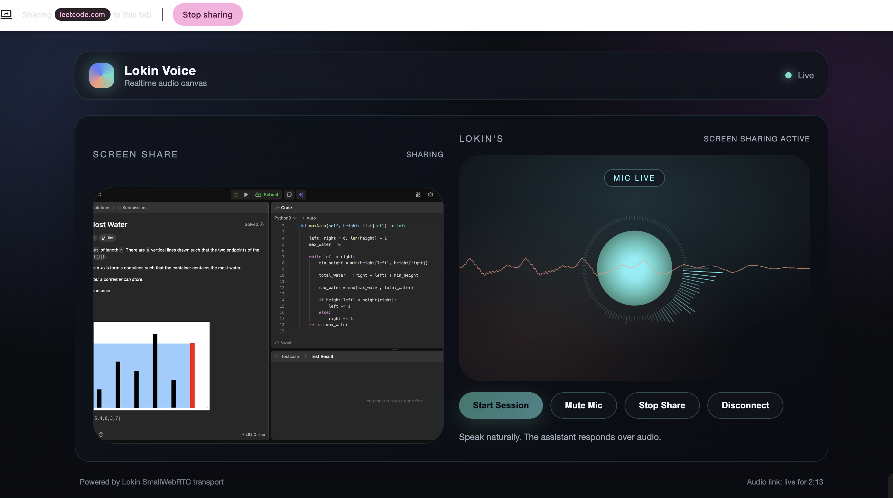

#### 🔧 Set Up the Environment - Client



1. **Clone the Repository**

```bash
git clone https://github.com/ZahrizhalAli/lokin.git
cd lokin
```

2. **Lokin Client**

We introduce a new Lokin UI Client.

Located in the `ui/dist/` directory that the UI will serve.

3. **Try the Sample App**

Now you can test the local package with the sample app:

```bash
uv sync  # Installs dependencies and the local package in editable mode
uv run app.py
```

Then open http://localhost:7860 in your browser.
